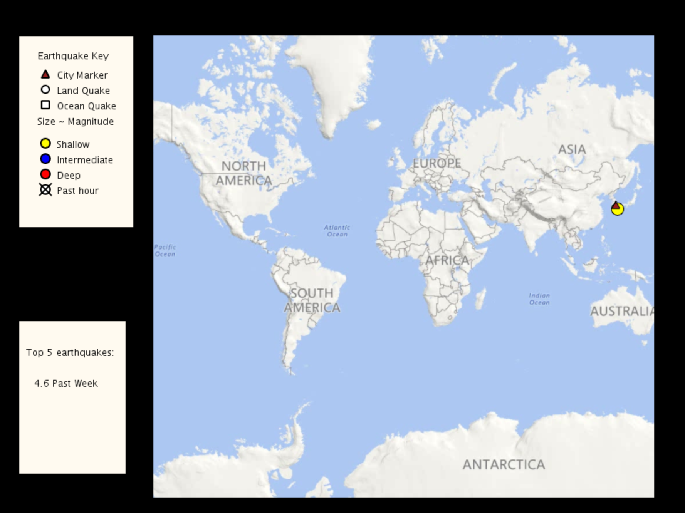
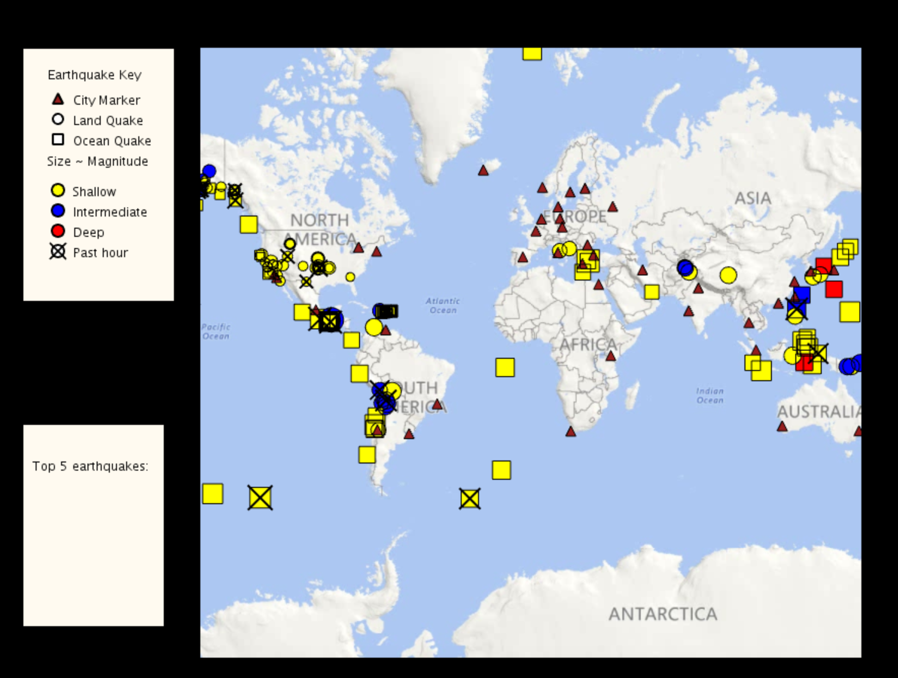

# EarthquakeMap
This is a java application using Microsoft API to show the relationship between earthquakes and geometry.

##INSTALLATION##

Import this folder in Eclipse ('File' -> 'Import' -> 'Existing Projects into
Workspace', Select this folder, 'Finish')

##MANUAL INSTALLATION##

If the import does not work follow the steps below.

- Create new Java project
- Copy+Paste all files into project
- Add all lib/*.jars to build path
- Set native library location for jogl.jar. Choose appropriate folder for your OS.
- Add data/ as src

##TROUBLE SHOOTING##

Switch Java Compiler to 1.6 if you get VM problems. (Processing should work with Java 1.6, and 1.7)

##DEMO##
 

 
